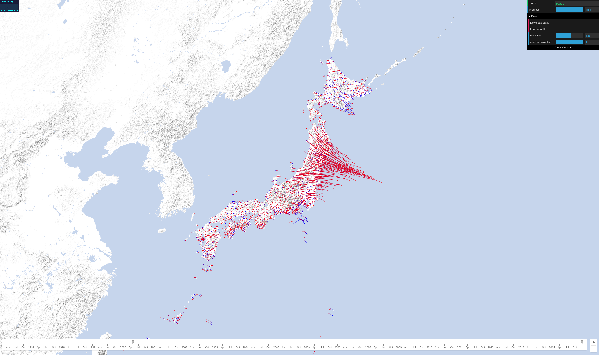

# Geodetic Velocities Visualization



This visualization renders Global Navigation Satellite System (GNSS) position
time series data on top of an interactive Google Map.

By manipulating the magnification level and the timespan, you can see how the
Earth has moved over time.

## Setup

To use Google Maps, you need a browser API key.
Follow these instructions to
[Get a Key/Authentication](https://developers.google.com/maps/documentation/javascript/get-api-key#key).

Once you have your API key, open up the `index.html` file and find this line:
```js
var apiKey = '';
```

Paste in your API key and save the file.

## Usage

To use this visualization, first you'll need to produce or acquire a GNSS data
file.

The visualization expects to find a file named `beacon-data.json` in the data/
directory. See the README file there for details on the format.

Once you have a data file, dowload this source code and serve the contents. If
you have Python installed, you can use its `SimpleHTTPServer` to see this
working locally.

```sh
$ python -m SimpleHTTPServer 8000
```

Then open a browser to http://localhost:8000 to see the visualization.

## Disclaimer

This is not an official Google product.
